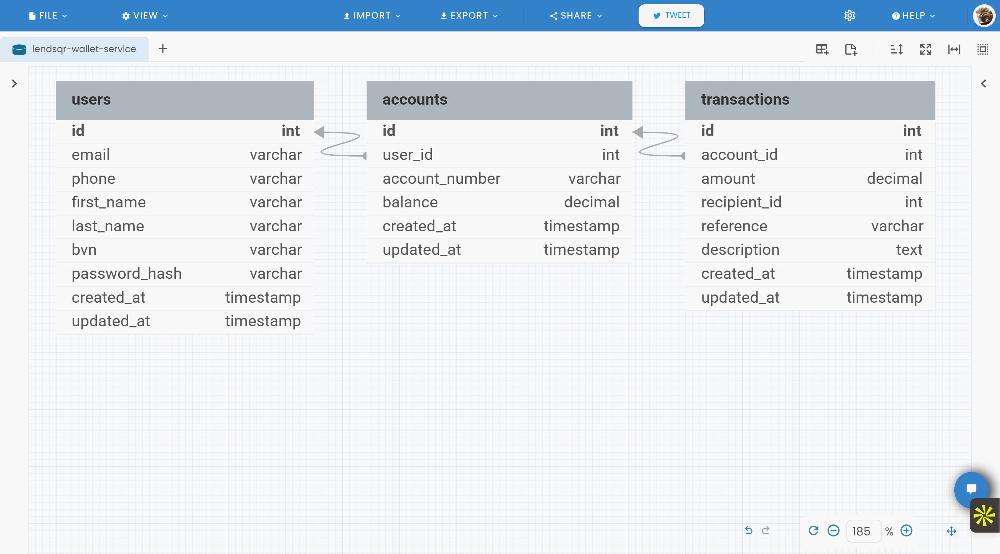

# Lendsqr Wallet Service

[](https://nodejs.org/)
[](https://www.typescriptlang.org/)
[](https://www.mysql.com/)
[](LICENSE)
[](coverage)

A robust, scalable wallet service built with Node.js, TypeScript, and MySQL. This service provides comprehensive wallet management capabilities including user authentication, account funding, money transfers, withdrawals, and transaction history management.

## 🚀 Features

### Core Functionality
- **User Authentication & Authorization** - JWT-based secure authentication
- **Account Management** - Automatic account creation with unique account numbers
- **Wallet Operations** - Fund, transfer, and withdraw money
- **Transaction History** - Comprehensive transaction tracking and filtering
- **Blacklist Integration** - Adjutor/Karma blacklist verification
- **Rate Limiting** - Configurable rate limiting for API protection
- **Input Validation** - Comprehensive request validation using Joi
- **Error Handling** - Centralized error handling with detailed logging


> ℹ️ **Note on KYC Implementation**  
A Know Your Customer (KYC) feature is currently under development as part of extended functionality. While not included in the original assessment requirements, this feature is being built and tested in the controller layer (`KYCController.ts`) and demonstrates proactive security integration.


### Security Features
- **Password Hashing** - bcrypt with configurable salt rounds
- **JWT Authentication** - Secure token-based authentication
- **Request Validation** - Input sanitization and validation
- **Rate Limiting** - Protection against abuse and DDoS
- **CORS Configuration** - Configurable cross-origin resource sharing
- **Helmet Security** - Security headers and protection

### Technical Features
- **Database Transactions** - ACID compliance for financial operations
- **Comprehensive Logging** - Winston-based structured logging
- **Unit Testing** - Extensive test coverage with Jest
- **API Documentation** - Postman collection and environment
- **Environment Configuration** - Flexible environment-based configuration
- **Database Migrations** - Knex.js migrations and seeding

## 🏗️ Architecture
## 🗂️ Entity Relationship Diagram

Below is the ER diagram that represents the relationship between `users`, `accounts`, and `transactions`.




### Technology Stack
- **Runtime**: Node.js 18.x
- **Language**: TypeScript 5.x
- **Framework**: Express.js
- **Database**: MySQL 8.x
- **ORM**: Knex.js
- **Authentication**: JWT (jsonwebtoken)
- **Validation**: Joi
- **Testing**: Jest + Supertest
- **Logging**: Winston
- **Security**: Helmet, bcryptjs, express-rate-limit

### Project Structure
```
src/
├── app.ts                 # Application entry point
├── config/
│   └── database.ts        # Database configuration
├── controllers/           # Request handlers
│   ├── AuthController.ts
│   └── WalletController.ts
├── middleware/           # Custom middleware
│   ├── auth.ts
│   ├── errorHandler.ts
│   └── rateLimiter.ts
├── models/              # Data models and interfaces
│   ├── User.ts
│   ├── Account.ts
│   └── Transaction.ts
├── repositories/        # Data access layer
│   ├── UserRepository.ts
│   ├── AccountRepository.ts
│   └── TransactionRepository.ts
├── routes/             # API routes
│   ├── authRoutes.ts
│   └── walletRoutes.ts
├── services/           # Business logic layer
│   ├── AuthService.ts
│   ├── WalletService.ts
│   └── AdjutorService.ts
├── utils/              # Utility functions
│   ├── helpers.ts
│   ├── validators.ts
│   ├── logger.ts
│   └── AppError.ts
├── database/           # Database files
│   ├── migrations/     # Database migrations
│   └── seeds/         # Database seeds
└── tests/             # Test files
    ├── controllers/
    ├── services/
    ├── repositories/
    ├── middleware/
    └── utils/
```

## 🚦 Getting Started

### Prerequisites
- Node.js 18.x or higher
- npm or yarn
- MySQL 8.x
- Git

### Installation

1. **Clone the repository**
   ```bash
   git clone https://github.com/your-org/lendsqr-wallet-service.git
   cd lendsqr-wallet-service
   ```

2. **Install dependencies**
   ```bash
   npm install
   ```

3. **Environment setup**
   ```bash
   cp .env.example .env
   ```
   
   Configure your `.env` file:
   ```env
   # Server Configuration
   NODE_ENV=development
   PORT=3000
   API_VERSION=v1
   API_BASE_URL=http://localhost:3000

   # Database Configuration
   DB_HOST=localhost
   DB_PORT=3306
   DB_USER=your_username
   DB_PASSWORD=your_password
   DB_NAME=lendsqr_wallet
   DB_TEST_NAME=lendsqr_wallet_test

   # JWT Configuration
   JWT_SECRET=your_super_secret_jwt_key_here
   JWT_EXPIRES_IN=24h

   # Rate Limiting
   RATE_LIMIT_WINDOW_MS=900000
   RATE_LIMIT_MAX_REQUESTS=100
   AUTH_RATE_LIMIT_MAX_REQUESTS=5
   TRANSACTION_RATE_LIMIT_MAX_REQUESTS=10

   # Adjutor/Karma Configuration
   ADJUTOR_API_URL=https://adjutor.lendsqr.com/v2
   ADJUTOR_API_KEY=your_adjutor_api_key
   KARMA_ENDPOINT=/verification/karma
   ALLOW_REGISTRATION_ON_KARMA_FAILURE=true

   # Logging
   LOG_LEVEL=info
   ```

4. **Database setup**
   ```bash
   # Create database
   mysql -u root -p -e "CREATE DATABASE lendsqr_wallet;"
   mysql -u root -p -e "CREATE DATABASE lendsqr_wallet_test;"

   # Run migrations
   npm run migrate

   # Seed database (optional)
   npm run seed
   ```

5. **Start the application**
   ```bash
   # Development mode
   npm run dev

   # Production mode
   npm run build
   npm start
   ```

The API will be available at `https://muhammedfayemi-lendsqr-be-test.onrender.com`

## 📚 API Documentation
## 📬 Postman API Documentation

For a complete and interactive experience with the API, visit the live Postman documentation:

👉 **[Postman Collection Link](https://documenter.getpostman.com/view/26323710/2sB3B8sD7e)**  


### Base URL
```
Development: http://localhost:3000/api/v1
Production: https://api.lendsqr.com/api/v1
```

### Authentication
All protected endpoints require a Bearer token:
```
Authorization: Bearer <your_jwt_token>
```

### Endpoints Overview

#### Authentication Endpoints
- `POST /auth/register` - Register new user
- `POST /auth/login` - User login
- `GET /auth/profile` - Get user profile (protected)
- `POST /auth/refresh-token` - Refresh JWT token (protected)

#### Wallet Endpoints
- `GET /wallet/balance` - Get wallet balance (protected)
- `POST /wallet/fund` - Fund account (protected)
- `POST /wallet/transfer` - Transfer funds (protected)
- `POST /wallet/withdraw` - Withdraw funds (protected)
- `GET /wallet/transactions` - Get transaction history (protected)
- `GET /wallet/transactions/:reference` - Get transaction by reference (protected)
- `GET /wallet/summary` - Get account summary (protected)

#### Health Check
- `GET /health` - Service health check
- `GET /api/v1` - API information

### Sample Requests

#### User Registration
```bash
curl -X POST http://localhost:3000/api/v1/auth/register \
  -H "Content-Type: application/json" \
  -d '{
    "email": "john.doe@example.com",
    "phone": "08123456789",
    "firstName": "John",
    "lastName": "Doe",
    "bvn": "12345678901",
    "password": "Password123!"
  }'
```

#### Fund Account
```bash
curl -X POST http://localhost:3000/api/v1/wallet/fund \
  -H "Content-Type: application/json" \
  -H "Authorization: Bearer <your_token>" \
  -d '{
    "amount": 50000,
    "description": "Initial funding"
  }'
```

#### Transfer Funds
```bash
curl -X POST http://localhost:3000/api/v1/wallet/transfer \
  -H "Content-Type: application/json" \
  -H "Authorization: Bearer <your_token>" \
  -d '{
    "recipientAccountNumber": "0987654321",
    "amount": 5000,
    "description": "Transfer to friend"
  }'
```

For complete API documentation with examples, import the Postman collection from `/postman/` directory.

## 🧪 Testing

### Running Tests
```bash
# Run all tests
npm test

# Run tests with coverage
npm run test:coverage

# Run tests in watch mode
npm run test:watch

# Run specific test file
npm test -- AuthController.test.ts
```

### Test Structure
- **Unit Tests**: Individual component testing
- **Integration Tests**: API endpoint testing
- **Repository Tests**: Database interaction testing
- **Service Tests**: Business logic testing
- **Middleware Tests**: Authentication and validation testing

### Test Coverage
The project maintains >95% test coverage across:
- Controllers
- Services
- Repositories
- Middleware
- Utilities

## 🔧 Development

### Available Scripts
```bash
npm run dev          # Start development server with hot reload
npm run build        # Build for production
npm start           # Start production server
npm test            # Run tests
npm run test:coverage # Run tests with coverage
npm run migrate     # Run database migrations
npm run migrate:rollback # Rollback last migration
npm run seed        # Seed database with test data
npm run lint        # Run ESLint
npm run lint:fix    # Fix ESLint issues
```

### Database Operations
```bash
# Create new migration
npx knex migrate:make migration_name

# Run migrations
npm run migrate

# Rollback migrations
npm run migrate:rollback

# Create seed file
npx knex seed:make seed_name

# Run seeds
npm run seed
```

### Code Quality
- **ESLint**: Code linting and formatting
- **Prettier**: Code formatting
- **TypeScript**: Type checking
- **Jest**: Testing framework
- **Husky**: Git hooks for quality checks

## 🚀 Deployment

### Environment Setup
1. Set up production environment variables
2. Configure database connection
3. Set up SSL certificates
4. Configure reverse proxy (nginx/Apache)

### Docker Deployment
```dockerfile
# Dockerfile example
FROM node:18-alpine
WORKDIR /app
COPY package*.json ./
RUN npm ci --only=production
COPY . .
RUN npm run build
EXPOSE 3000
CMD ["npm", "start"]
```

### Production Checklist
- [ ] Environment variables configured
- [ ] Database migrations run
- [ ] SSL certificates installed
- [ ] Rate limiting configured
- [ ] Logging configured
- [ ] Monitoring set up
- [ ] Backup strategy implemented

## 🔒 Security

### Security Measures
- **Password Hashing**: bcrypt with salt rounds
- **JWT Authentication**: Secure token-based auth
- **Input Validation**: Comprehensive request validation
- **Rate Limiting**: API abuse protection
- **CORS**: Cross-origin request control
- **Helmet**: Security headers
- **SQL Injection Prevention**: Parameterized queries
- **XSS Protection**: Input sanitization

### Security Best Practices
1. Keep dependencies updated
2. Use environment variables for secrets
3. Implement proper error handling
4. Log security events
5. Regular security audits
6. Monitor for suspicious activities

## 📊 Monitoring & Logging

### Logging
- **Winston**: Structured logging
- **Log Levels**: Error, Warn, Info, Debug
- **Log Rotation**: Automatic log file rotation
- **Centralized Logging**: JSON format for easy parsing

### Monitoring
- Health check endpoints
- Performance metrics
- Error tracking
- Database connection monitoring
- Rate limit monitoring

## 🤝 Contributing

### Development Workflow
1. Fork the repository
2. Create a feature branch (`git checkout -b feature/amazing-feature`)
3. Make your changes
4. Add tests for new functionality
5. Ensure all tests pass (`npm test`)
6. Commit your changes (`git commit -m 'Add amazing feature'`)
7. Push to the branch (`git push origin feature/amazing-feature`)
8. Open a Pull Request

### Code Standards
- Follow TypeScript best practices
- Maintain test coverage >95%
- Use meaningful commit messages
- Document new features
- Follow existing code style

### Pull Request Process
1. Update documentation if needed
2. Add tests for new features
3. Ensure CI/CD passes
4. Request review from maintainers
5. Address review feedback

## 📄 License

This project is licensed under the MIT License - see the [LICENSE](LICENSE) file for details.

## 🆘 Support

### Getting Help
- **Documentation**: Check this README and API docs
- **Issues**: Create an issue on GitHub
- **Discussions**: Use GitHub Discussions for questions
- **Email**: contact@lendsqr.com

### Reporting Issues
When reporting issues, please include:
- Node.js version
- Operating system
- Error messages
- Steps to reproduce
- Expected vs actual behavior

## 🙏 Acknowledgments

- [Express.js](https://expressjs.com/) - Web framework
- [Knex.js](https://knexjs.org/) - SQL query builder
- [Jest](https://jestjs.io/) - Testing framework
- [Winston](https://github.com/winstonjs/winston) - Logging library
- [Joi](https://joi.dev/) - Data validation

## 📈 Roadmap

### Upcoming Features
- [ ] Multi-currency support
- [ ] Transaction webhooks
- [ ] Advanced analytics
- [ ] Mobile SDK
- [ ] GraphQL API
- [ ] Real-time notifications
- [ ] Advanced fraud detection
- [ ] API versioning
- [ ] Microservices architecture
- [ ] Kubernetes deployment

### Version History
- **v1.0.0** - Initial release with core wallet functionality
- **v1.1.0** - Added transaction filtering and pagination
- **v1.2.0** - Integrated Adjutor blacklist verification
- **v1.3.0** - Enhanced security and rate limiting

---

**Built with ❤️ by  Muhadev**
